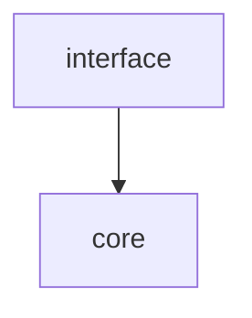

# Core package

## Directories

### 1. queenbees
Core django application.

It follows a layer structure:



### 2. tests
All application tests

## How-to

### Dependency management

* Add global dependency
```shell
poetry add <dependency-name>
```

* Add test dependency
```shell
poetry add <dependency-name> --group test
```
